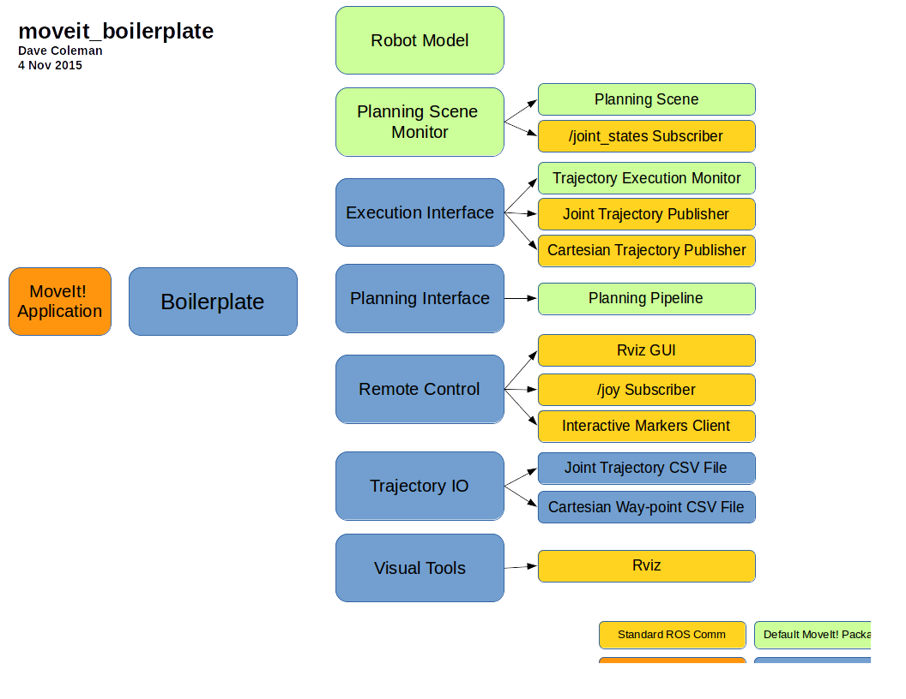

# MoveIt! Boilerplate

Quickly get started with MoveIt! in C++ with several easy to use classes.

Features:

 - Boilerplate base class
 - Execution interface for easily sending commands to robot
 - Planning interface
 - Remote control for use with various input devices
 - Trajectory input output from file

Developed by [Dave Coleman](http://dav.ee/) at the University of Colorado Boulder

Status:

 *  Indigo Travis CI
 *  Indigo Devel Job Status
 *  Indigo AMD64 Debian Job Status

## Install

### Ubuntu Debian

    sudo apt-get install ros-indigo-moveit-boilerplate

### Build from Source

To build this package, ``git clone`` this repo into a [catkin workspace](http://wiki.ros.org/catkin/Tutorials/create_a_workspace) and be sure to install necessary dependencies by running the following command in the root of your catkin workspace:

    rosdep install -y --from-paths src --ignore-src --rosdistro indigo

## Code API

See [Class Reference](http://docs.ros.org/indigo/api/moveit_boilerplate/html/)

## Usage

### Required Configurations:

See ``config/config_example.yaml``

### Boilerplate

Inherit your MoveIt! from this base class to quickly give you:

 - Planning Scene Monitor
 - Robot Model
 - Current Robot State
 - Execution interface to controllers
 - Planning interface to OMPL, etc
 - Debug interface interface to joysticks, interactive markers, etc
 - File read/write for joint and cartesian trajectory
 - Visual tools for debugging in Rviz

### Execution Interface

There are three modes for controlling robots, with lots of debug introsecption functions.

### Planning Interface

Various functions for Cartesian and sampling-based motion planning

### Remote Control

Wrapper for joystick and interactive marker subscribing, as well as a Rviz GUI plugin

### Trajectory IO

Load and save CSV files for both joint trajectories and cartesian trajectories.

## Testing

To run [roslint](http://wiki.ros.org/roslint), use the following command with [catkin-tools](https://catkin-tools.readthedocs.org/):

    catkin build --no-status --no-deps --this --make-args roslint

To run [catkin lint](https://pypi.python.org/pypi/catkin_lint), use the following command with [catkin-tools](https://catkin-tools.readthedocs.org/):

    catkin lint -W2

There are currently no unit or integration tests for this package.

## Contribute

Please send PRs for new helper functions, fixes, etc!
